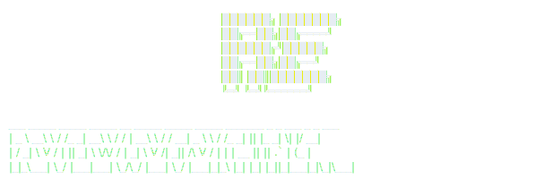

<p align="center">
  <picture>
    <source media="(prefers-color-scheme: dark)" srcset="assets/banner-dark.svg">
    <source media="(prefers-color-scheme: light)" srcset="assets/banner-light.svg">
    
  </picture>
</p>

<p align="center">
Desktop diff viewer powered by <a href="https://difftastic.wilfred.me.uk/">difftastic</a> — built with Tauri + Svelte + Rust
</p>

<p align="center">


</p>

## Features

- **Structural diffs** — Understands code syntax, not just text lines. Powered by difftastic + tree-sitter.
- **Side-by-side view** — Old and new content aligned with syntax highlighting.
- **Commit log browser** — Navigate your git history, select any commit to review.
- **Compare any two refs** — Diff between arbitrary commits, branches, staged changes, or working tree.
- **File tree** — Collapsible tree pane with addition/deletion stats per file and directory.
- **Review tracking** — Mark files as reviewed. Progress persists across sessions (per-repo SQLite database).
- **Keyboard-driven** — Full vim-style navigation (j/k, g/G, n/N, Ctrl+d/u). Mouse works too.
- **Repository switcher** — Open any repo, recent repos remembered. Type a path with tab-completion or browse with the native folder picker.
- **Cross-platform** — macOS, Windows, and Linux. Difftastic is bundled — no separate installation required.

## Download

Download the latest release for your platform from the [Releases](../../releases) page:

| Platform | File |
|----------|------|
| macOS (Apple Silicon) | `Review Everything_x.x.x_aarch64.dmg` |
| macOS (Intel) | `Review Everything_x.x.x_x64.dmg` |
| Windows | `Review Everything_x.x.x_x64-setup.exe` |
| Linux (Debian/Ubuntu) | `review-everything_x.x.x_amd64.deb` |
| Linux (AppImage) | `review-everything_x.x.x_amd64.AppImage` |

### Install

- **macOS**: Open the `.dmg` and drag to Applications. On first launch, right-click → Open to bypass Gatekeeper.
- **Windows**: Run the `.exe` installer.
- **Linux**: `sudo dpkg -i review-everything_*.deb` or run the `.AppImage` directly.

### Uninstall

- **macOS**: Drag from Applications to Trash.
- **Windows**: Settings → Apps → Review Everything → Uninstall.
- **Linux**: `sudo dpkg -r review-everything` or delete the AppImage file.

## Keyboard Shortcuts

### Navigation
| Key | Action |
|-----|--------|
| `j` / `k` | Scroll down / up |
| `g` / `G` | Go to top / bottom |
| `Ctrl+d` / `Ctrl+u` | Half page down / up |
| `n` / `N` | Next / previous hunk |
| `]` / `[` | Next / previous file |
| `h` / `l` | Scroll left / right |

### Diff View
| Key | Action |
|-----|--------|
| `Tab` | Toggle tree focus |
| `t` | Toggle tree visibility |
| `r` | Toggle reviewed mark |
| `R` | Clear all reviews |
| `Esc` / `q` | Back |
| `?` | Help |

### Log / Compare
| Key | Action |
|-----|--------|
| `Enter` | Select commit |
| `c` | Compare mode |
| `o` | Open / switch repository |
| `/` | Search |
| `Ctrl+r` | Refresh |

## Building from Source

### Prerequisites

- [Rust](https://rustup.rs/) (stable)
- [Node.js](https://nodejs.org/) (v18+)
- Platform dependencies for Tauri — see [Tauri prerequisites](https://v2.tauri.app/start/prerequisites/)

### Development

```sh
# Install frontend dependencies
npm install

# Download the difft binary for your platform
cd src-tauri/binaries
./download-difft.sh
cd ../..

# Run in development mode (uses system difft from PATH as fallback)
npx tauri dev
```

### Production Build

```sh
# Download difft for your platform (if not already done)
cd src-tauri/binaries && ./download-difft.sh && cd ../..

# Build the app
npx tauri build
```

The built installer will be in `src-tauri/target/release/bundle/`.

## How It Works

1. The Rust backend shells out to `git` for log, status, and file content retrieval.
2. Changed files are diffed in parallel using the bundled [difftastic](https://github.com/Wilfred/difftastic) binary, which produces structured JSON output.
3. The processor converts difftastic's structural diff into aligned, syntax-highlighted rows.
4. The Svelte frontend renders a side-by-side diff view with the aligned rows.
5. Review state is stored in a per-repo SQLite database, keyed by content hashes so stale reviews are automatically invalidated.

## License

[MIT](LICENSE)

## Acknowledgments

- [Difftastic](https://github.com/Wilfred/difftastic) by Wilfred Hughes — the structural diff engine that makes this possible.
- [Tauri](https://tauri.app/) — lightweight, secure desktop app framework.
